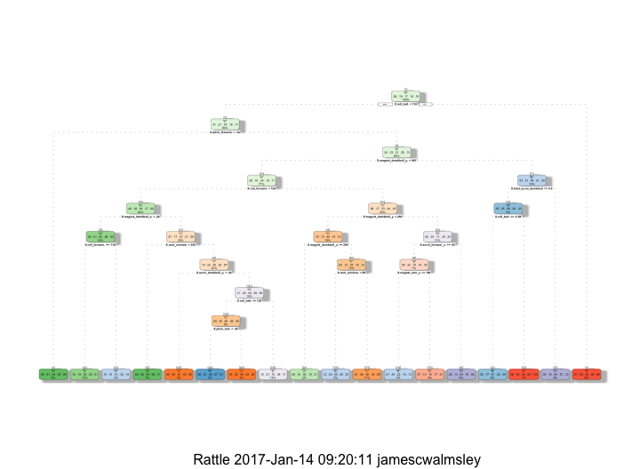

# Practical Machine Learning Course Project (Personal Activity Predictions)
james c walmsley  
1/10/2017  
## EXECUTIVE SUMMARY:
        Background
        "Using devices such as Jawbone Up, Nike FuelBand, and Fitbit it is now possible to collect a large  
        amount of data about personal activity relatively inexpensively. These type of devices are part of  
        the quantified self movement – a group of enthusiasts who take measurements about themselves regularly  
        to improve their health, to find patterns in their behavior, or because they are tech geeks. One thing  
        that people regularly do is quantify how much of a particular activity they do, but they rarely  
        quantify how well they do it. In this project, your goal will be to use data from accelerometers on the  
        belt, forearm, arm, and dumbell of 6 participants. They were asked to perform barbell lifts correctly  
        and incorrectly in 5 different ways. More information is available from the website here:  
        http://groupware.les.inf.puc-rio.br/har (see the section on the Weight Lifting Exercise Dataset)."
        #
        Data
        The training data for this project are available here:
        https://d396qusza40orc.cloudfront.net/predmachlearn/pml-training.csv
        The test data are available here:
        https://d396qusza40orc.cloudfront.net/predmachlearn/pml-testing.csv
        The data for this project come from this source: 
        http://groupware.les.inf.puc-rio.br/har.  
        #
        A) How the Model was built:
        In order to build a predictive model from the two data sets provided we first removed all irrelevant  
        columns of variables having no impact on the predictability of the model being built (ie., variables  
        which were not measurements) and variables with near zero variance (ie., having no significant  
        predictable value becuase of the lack of influence on the outcome). Next, the given training data  
        set was partitioned into two smaller data sets 1) new training data set and 2) a validation data set  
        to be used to check the accruacy of the selected model (this is what is called cross validation) before
        applying it to the given test data set for the final predictions. We first tested a classification  
        tree model and found its accuracy to be below the desireded 80% accuracy or better it was at best less  
        than 72% accrurate. Therefore we moved to the randomForest classification method where we ended up  
        with a model capable of predicting with an accuracy of over 99% and a 95% CI with a lower limit of  
        99.43% and an upper limit of 99.77% and with an estimated out of sample error rate of .000373 using  
        7 variables in each of 100 trees.
        #
        B) The results of applying the randomForest model fit for prediction on the original test data set  
        provided was 100% based on the results of the solutions for the prediction test questions. 
        #
        C) My conclusion is that while the randomForest model prediction method is very accruate it is a bit  
        complex and takes a little more time to process and because of this high complexity is it not easy to 
        develop and interpretation of how the prediction model actually works due to the large numbers of  
        permutations involved in the calculation. 


     
## CLEAN & SET UP THE ENVIRONMENT:

```r
#rm(list=ls())
local({r <- getOption("repos")
       r["CRAN"] <- "http://cran.r-project.org"
       options(repos=r)
})
setwd("~/Desktop/Coursera_R/8_PracticalMachineLearning/PracticalMachineLearning")
```

## RAW DATA IMPORT:
## The data for this project come from this source: http://groupware.les.inf.puc-rio.br/har.

```r
# Download the training data set
trainUrl <- "http://d396qusza40orc.cloudfront.net/predmachlearn/pml-training.csv"
csvTrainingFile <- "pml-training.csv"
if (!file.exists(csvTrainingFile)){
        message(paste("Downloding", csvTrainingFile))
        download.file(trainUrl, destfile="pml-training.csv", method = "curl")
}else{
        message(paste("File exists;", csvTrainingFile))
}
```

```
## Downloding pml-training.csv
```

```r
dateDownLoaded <- date()
dateDownLoaded
```

```
## [1] "Sat Jan 14 13:48:22 2017"
```

```r
# Download the test data set
testUrl <- "http://d396qusza40orc.cloudfront.net/predmachlearn/pml-testing.csv"
csvTestingFile <- "pml-testing.csv"
if (!file.exists(csvTestingFile)) {
        message(paste("Downloding", csvTestingFile))
        download.file(testUrl, destfile="pml-testing.csv", method = "curl")
}else{
        message(paste("File exists;", csvTestingFile))
}
```

```
## Downloding pml-testing.csv
```

```r
dateDownLoaded <- date()
dateDownLoaded
```

```
## [1] "Sat Jan 14 13:48:23 2017"
```
## READ AND SAVE THE CSV DATA:

```r
# Read and save the training and test data csv files 
# training
csvTrainingFile <- read.csv("pml-training.csv", header = TRUE, sep = ",", quote = "", na.strings = c("NA","#DIV/0!",""))
training <- csvTrainingFile
# testing
csvTestingFile <- read.csv("pml-testing.csv", header = TRUE, sep = ",", quote = "", na.strings = c("NA","#DIV/0!",""))
testing <- csvTestingFile
```
## PROCESS DATA BY REMOVING IRRELEVANT DATA:

```r
library(caret)
nopredval <- c(1:6) # remove columns with no predictive value
lowvar <- nearZeroVar(testing) # remove vales with near zero variance
training2 <- training[, -c(nopredval,lowvar)]
testing2 <- testing[, -c(nopredval,lowvar)]
```
## MODELING, WE PARTITION WITH A 70:30 SPLIT THE TRAINING DATA TO GET A TRAINING & VALIDATION DATA SET:

```r
# Here we have split the original training data set into two samller data sets consisting
# of a new training data set 70% of the size of the original training set and the
# remainig 30% of the data will be a validation data set to test the prediction models built  
# a prediction model on the original test data set
```
## USING THE CLASSIFICATION TREE MODEL TO PREDICT ON THE TRAINING DATA SET:

```r
# MODELING for prediction:
# PART 1 - Using the Classification - Decision Tree method on the training data set
set.seed(96723)
install.packages("rattle");install.packages("rpart")
```

```
## 
## The downloaded binary packages are in
## 	/var/folders/8k/2jzlfw_95zz_62dhv5kxlps00000gn/T//RtmpQb5tPH/downloaded_packages
```

```
## 
## The downloaded binary packages are in
## 	/var/folders/8k/2jzlfw_95zz_62dhv5kxlps00000gn/T//RtmpQb5tPH/downloaded_packages
```

```r
library(rpart.plot);library(rpart);library(rattle)
f1a <- rpart::rpart(classe ~ ., data = trainingSplit, method = "class")
rattle::fancyRpartPlot(f1a)
```

<!-- -->

```r
predictf1a <- predict(f1a, trainingSplit, type = "class")
confMatrf1a <- confusionMatrix(predictf1a, trainingSplit$classe)
confMatrf1a
```

```
## Confusion Matrix and Statistics
## 
##           Reference
## Prediction  "A"  "B"  "C"  "D"  "E"
##        "A" 3387  376   50  154  175
##        "B"  124 1513  162  193  285
##        "C"   18  130 1810  305  142
##        "D"  327  559  323 1509  325
##        "E"   50   80   51   91 1598
## 
## Overall Statistics
##                                          
##                Accuracy : 0.7146         
##                  95% CI : (0.707, 0.7222)
##     No Information Rate : 0.2843         
##     P-Value [Acc > NIR] : < 2.2e-16      
##                                          
##                   Kappa : 0.6389         
##  Mcnemar's Test P-Value : < 2.2e-16      
## 
## Statistics by Class:
## 
##                      Class: "A" Class: "B" Class: "C" Class: "D"
## Sensitivity              0.8671     0.5692     0.7554     0.6701
## Specificity              0.9232     0.9310     0.9475     0.8664
## Pos Pred Value           0.8177     0.6645     0.7526     0.4959
## Neg Pred Value           0.9459     0.9001     0.9483     0.9305
## Prevalence               0.2843     0.1935     0.1744     0.1639
## Detection Rate           0.2466     0.1101     0.1318     0.1098
## Detection Prevalence     0.3015     0.1658     0.1751     0.2215
## Balanced Accuracy        0.8952     0.7501     0.8515     0.7683
##                      Class: "E"
## Sensitivity              0.6329
## Specificity              0.9757
## Pos Pred Value           0.8545
## Neg Pred Value           0.9219
## Prevalence               0.1838
## Detection Rate           0.1163
## Detection Prevalence     0.1361
## Balanced Accuracy        0.8043
```

```r
plot(confMatrf1a$table, col = confMatrf1a$byClass, main = paste("Confusion Matrix: Accuracy = ", round(confMatrf1a$overall["Accuracy"], 4)))
```

<!-- -->
 


## USING THE CLASSIFICATION TREE MODEL TO PREDICT ON THE VALIDATION DATA SET:

```r
# PART 2 Using the Classification - Decision Tree method on the validation data set
set.seed(36528)
f1b <- rpart::rpart(classe ~ ., data = trainingSplit, method = "class")
rattle::fancyRpartPlot(f1b)
```

<!-- -->

```r
predictf2b <- predict(f1b, validationSplit, type = "class")
confMatrf2b <- confusionMatrix(validationSplit$classe, predictf2b)
confMatrf2b
```

```
## Confusion Matrix and Statistics
## 
##           Reference
## Prediction  "A"  "B"  "C"  "D"  "E"
##        "A" 1440   49   10  149   26
##        "B"  143  657   64  241   34
##        "C"   27   76  752  140   31
##        "D"   51   92  128  650   43
##        "E"   71  119   71  112  709
## 
## Overall Statistics
##                                           
##                Accuracy : 0.715           
##                  95% CI : (0.7033, 0.7265)
##     No Information Rate : 0.2943          
##     P-Value [Acc > NIR] : < 2.2e-16       
##                                           
##                   Kappa : 0.6397          
##  Mcnemar's Test P-Value : < 2.2e-16       
## 
## Statistics by Class:
## 
##                      Class: "A" Class: "B" Class: "C" Class: "D"
## Sensitivity              0.8314     0.6616     0.7337     0.5031
## Specificity              0.9437     0.9015     0.9436     0.9316
## Pos Pred Value           0.8602     0.5768     0.7329     0.6743
## Neg Pred Value           0.9307     0.9292     0.9438     0.8695
## Prevalence               0.2943     0.1687     0.1742     0.2195
## Detection Rate           0.2447     0.1116     0.1278     0.1105
## Detection Prevalence     0.2845     0.1935     0.1743     0.1638
## Balanced Accuracy        0.8875     0.7816     0.8386     0.7174
##                      Class: "E"
## Sensitivity              0.8410
## Specificity              0.9260
## Pos Pred Value           0.6553
## Neg Pred Value           0.9721
## Prevalence               0.1432
## Detection Rate           0.1205
## Detection Prevalence     0.1839
## Balanced Accuracy        0.8835
```

```r
plot(confMatrf2b$table, col = confMatrf2b$byClass, main = paste("Confusion Matrix: Accuracy = ", round(confMatrf2b$overall["Accuracy"], 4)))
```

<!-- -->


## GENERATING THE RANDOM FOREST MODEL ON THE TRAINING DATA SET:

```r
# PART 3 Using the Random Forest Method generate the prediction model
set.seed(675)
install.packages("randomForest");library(randomForest)
```

```
## Installing package into '/Users/jamescwalmsley/Library/R/3.3/library'
## (as 'lib' is unspecified)
```

```
## 
## The downloaded binary packages are in
## 	/var/folders/8k/2jzlfw_95zz_62dhv5kxlps00000gn/T//RtmpQb5tPH/downloaded_packages
```

```
## randomForest 4.6-12
```

```
## Type rfNews() to see new features/changes/bug fixes.
```

```
## 
## Attaching package: 'randomForest'
```

```
## The following object is masked from 'package:ggplot2':
## 
##     margin
```

```r
rfmod1 <- randomForest(classe ~ ., data = trainingSplit, importance=T, ntree=100)
rfmod1
```

```
## 
## Call:
##  randomForest(formula = classe ~ ., data = trainingSplit, importance = T,      ntree = 100) 
##                Type of random forest: classification
##                      Number of trees: 100
## No. of variables tried at each split: 7
## 
##         OOB estimate of  error rate: 0.27%
## Confusion matrix:
##      "A"  "B"  "C"  "D"  "E"  class.error
## "A" 3905    1    0    0    0 0.0002560164
## "B"    5 2649    4    0    0 0.0033860045
## "C"    0   11 2383    2    0 0.0054257095
## "D"    0    0    9 2243    0 0.0039964476
## "E"    0    1    0    4 2520 0.0019801980
```


## USING THE RANDOM FOREST MODEL FOR PREDICTION ON THE VALIDATION DATA SET:

```r
# PART 4 Validate the RandonForest model predictions using the validation data set
set.seed(342)
predictfrmod1 <- predict(rfmod1, validationSplit, type = "class")
confMatrrfmod1 <- confusionMatrix(validationSplit$classe, predictfrmod1)
confMatrrfmod1
```

```
## Confusion Matrix and Statistics
## 
##           Reference
## Prediction  "A"  "B"  "C"  "D"  "E"
##        "A" 1674    0    0    0    0
##        "B"    2 1134    3    0    0
##        "C"    0    3 1023    0    0
##        "D"    0    0    8  955    1
##        "E"    0    0    0    5 1077
## 
## Overall Statistics
##                                           
##                Accuracy : 0.9963          
##                  95% CI : (0.9943, 0.9977)
##     No Information Rate : 0.2848          
##     P-Value [Acc > NIR] : < 2.2e-16       
##                                           
##                   Kappa : 0.9953          
##  Mcnemar's Test P-Value : NA              
## 
## Statistics by Class:
## 
##                      Class: "A" Class: "B" Class: "C" Class: "D"
## Sensitivity              0.9988     0.9974     0.9894     0.9948
## Specificity              1.0000     0.9989     0.9994     0.9982
## Pos Pred Value           1.0000     0.9956     0.9971     0.9907
## Neg Pred Value           0.9995     0.9994     0.9977     0.9990
## Prevalence               0.2848     0.1932     0.1757     0.1631
## Detection Rate           0.2845     0.1927     0.1738     0.1623
## Detection Prevalence     0.2845     0.1935     0.1743     0.1638
## Balanced Accuracy        0.9994     0.9982     0.9944     0.9965
##                      Class: "E"
## Sensitivity              0.9991
## Specificity              0.9990
## Pos Pred Value           0.9954
## Neg Pred Value           0.9998
## Prevalence               0.1832
## Detection Rate           0.1830
## Detection Prevalence     0.1839
## Balanced Accuracy        0.9990
```


```r
# Plot variable importance to see which variables have the most impact on the prediction model
library(randomForest)
impvars <- varImpPlot(rfmod1)
```

<!-- -->


```r
# Calculation of the expected out of sample error rate
ooer <- 1-confMatrrfmod1$overall[1]
names(ooer) <- "Out of Sample Error Rate"
ooer
```

```
## Out of Sample Error Rate 
##              0.003738318
```


## USING THE VALIDATED RANDOM FOREST PREDICTION MODEL ON THE TEST DATA SET:

```r
# PART 5 Using the randomForest method on the test data set
set.seed(846)
predictionstesting2 <- predict(rfmod1, newdata=testing2) #type = "class"
```

```
##  [1] "B" "A" "B" "A" "A" "E" "D" "B" "A" "A" "B" "C" "B" "A" "E" "E" "A"
## [18] "B" "B" "B"
## Levels: "A" "B" "C" "D" "E"
```

## PRODUCING A RESULTS DATA FRAME OF THE RANDOM FOREST PREDICTIONS ON THE TEST DATA SET:

```r
# Capturing the results of the randomForest prediction on the test data set as results
results <- data.frame(problem_id= testing2$X.problem_id., classe = predictionstesting2)
results
```

```
##    problem_id classe
## 1           1    "B"
## 2           2    "A"
## 3           3    "B"
## 4           4    "A"
## 5           5    "A"
## 6           6    "E"
## 7           7    "D"
## 8           8    "B"
## 9           9    "A"
## 10         10    "A"
## 11         11    "B"
## 12         12    "C"
## 13         13    "B"
## 14         14    "A"
## 15         15    "E"
## 16         16    "E"
## 17         17    "A"
## 18         18    "B"
## 19         19    "B"
## 20         20    "B"
```


